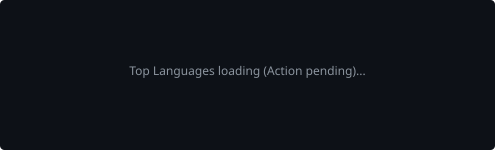

<div align="center">

# Akash Pal
### AI Engineer & Backend Developer

Building production-ready AI systems, scalable backend infrastructure, and intelligent multi-agent applications.

[](https://www.linkedin.com/in/akash-pal-299b4a29a/)
[](mailto:palakash160704@gmail.com)
[](https://leetcode.com/u/Akashpal_10/)
[](https://github.com/palAkash160704)

</div>

---

## Introduction

I am an AI Engineer and Backend Developer focused on architecting intelligent systems and scalable infrastructure. I build robust multi-agent orchestrations, retrieval-augmented generation (RAG) pipelines, and high-performance APIs. My technical expertise centers around Python, FastAPI, LangGraph, and modern full-stack technologies. Currently, I am developing production-grade agentic AI frameworks and automated testing solutions at Hewlett Packard Enterprise.

---

## Whoami

```bash
$ whoami

Name        : Akash Pal
Role        : AI Engineer & Backend Developer
Company     : Hewlett Packard Enterprise (HPE)
Location    : Bangalore, India
Focus       : AI Systems & Scalable Infrastructure
```

---

## Current Focus

- **Building Agentic AI Systems**
- **Backend Engineering**
- **Distributed Systems**
- **Retrieval-Augmented Generation**
- **System Design**

---

## Tech Stack

### Languages
    

### Frontend
    

### Backend
    

### AI / ML
     

### Databases
   

### Cloud & DevOps
  

### Developer Tools
  

---

## Experience

**Hewlett Packard Enterprise (HPE)**  
*Project Intern*

Engineered **Sentinel-QA**, a production-grade Agentic AI Testing Framework designed to orchestrate complex multi-agent workflows. Architected end-to-end multi-agent pipelines leveraging **LangGraph** to automate intelligent reasoning. Built high-performance scalable infrastructure using **FastAPI** and integrated semantic search capabilities via **ChromaDB**. Drove comprehensive automated and security testing protocols to ensure system reliability and enterprise-level robustness.

---

## Featured Projects

| Project | Description | Tech Stack | Links |
| :--- | :--- | :--- | :--- |
| **Sentinel-QA** | AI-powered Agentic Testing Framework utilizing multi-agent orchestration for security and automated testing. | `LangGraph` `FastAPI` `RAG` | [GitHub](https://github.com/palAkash160704/Sentinel-QA) |
| **ARGUS** | Context-aware multimodal surveillance system leveraging pose estimation and a physics engine. | `YOLOv11` `ST-GCN` `Pose Est.` | [GitHub](https://github.com/palAkash160704/ARGUS) |
| **TripAI** | Multi-Agent AI travel planner streaming intelligent real-time data via Server-Sent Events. | `FastAPI` `React` `Ollama` | [GitHub](https://github.com/palAkash160704/TripAI) |
| **AI Startup Validator** | Full-stack AI platform utilizing open-source LLMs to validate startup architectures and concepts. | `React` `Node.js` `LLaMA` | [GitHub](https://github.com/palAkash160704/AI-Startup-Validator) |
| **SkyCast** | High-performance, responsive weather application pulling real-time data from the Open-Meteo API. | `HTML` `CSS` `JavaScript` | [GitHub](https://github.com/palAkash160704/SkyCast) |

---

## GitHub Analytics

<div align="center">
  
  
</div>

<br>

<div align="center">
  
</div>

<br>

<div align="center">
  
</div>

---

## Achievements

- **Samsung PRISM Hackathon** – Participant
- **Code360** – Rating: 1764
- **Competitive Programming** – Active Problem Solver

---

## Certifications

- Google Cloud Career Launchpad – Generative AI
- MongoDB Developer Certification
- Data Structures & Algorithms
- Introduction to C++

---

## Currently Learning

- Kubernetes
- Cloud Deployment
- Distributed Systems
- Advanced RAG
- LLM Optimization

---

## Contact

- **LinkedIn:** [https://www.linkedin.com/in/akash-pal-299b4a29a/](https://www.linkedin.com/in/akash-pal-299b4a29a/)
- **Email:** [palakash160704@gmail.com](mailto:palakash160704@gmail.com)
- **GitHub:** [https://github.com/palAkash160704](https://github.com/palAkash160704)

---

<div align="center">
  <em>Always building. Always learning.</em>
</div>
