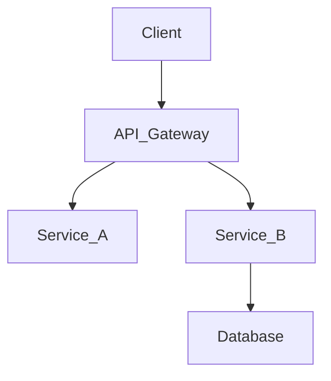

<div align="center">
  <!-- Replace with actual project icon (assets/icon.svg) -->
  

  <h1>Project Name</h1>
  <p><em>A brief 1-2 sentence description summarizing the core value and purpose of the project.</em></p>

  <!-- Tech Stack Badges row -->
  
  
  
</div>

---

## 📖 Overview

Provide a high-level summary of what the project does. Explain the problem it solves and why you built it. Keep paragraphs concise and information-dense.

> [!NOTE]
> Add any important prerequisites or architectural context the reader should know immediately.

---

## 🧠 Architecture

*Insert a Mermaid.js diagram or an SVG block diagram here.*



---

## 🛠 Tech Stack

| Category | Technology |
| :--- | :--- |
| **Language** | Python 3.10+ |
| **Framework** | FastAPI, LangGraph |
| **Database** | ChromaDB, PostgreSQL |
| **Deployment** | Docker, GitHub Actions |

---

## 📂 Folder Structure

```text
📦 project-root
 ┣ 📂 agents/             # Multi-agent orchestrations
 ┣ 📂 api/                # FastAPI routes and endpoints
 ┣ 📂 core/               # Configuration and security
 ┣ 📂 models/             # Pydantic and ORM schemas
 ┣ 📂 services/           # Business logic and external integrations
 ┣ 📜 main.py             # Application entrypoint
 ┗ 📜 requirements.txt    # Dependencies
```

---

## 🚀 Installation & Setup

1. **Clone the repository**
   ```bash
   git clone https://github.com/palAkash160704/project-name.git
   cd project-name
   ```

2. **Set up environment variables**
   ```bash
   cp .env.example .env
   ```

3. **Install dependencies**
   ```bash
   pip install -r requirements.txt
   ```

4. **Run the application**
   ```bash
   uvicorn main:app --reload
   ```

---

## ✨ Core Features

- **Feature 1:** Detailed explanation of the technical implementation.
- **Feature 2:** Mention the specific tool or algorithm used (e.g., *Integrated RAG pipeline using ChromaDB*).
- **Feature 3:** High performance or scaling capability.

---

## 📸 Screenshots / Demo

*Insert high-quality WebP or PNG images here with rounded corners if possible.*

```html
<div align="center">
  
</div>
```

---

## 🗺 Future Roadmap

- [ ] Implement advanced caching layer.
- [ ] Add support for WebSocket streaming.
- [ ] Comprehensive unit test coverage.

---

## 📄 License

This project is licensed under the [MIT License](LICENSE).
