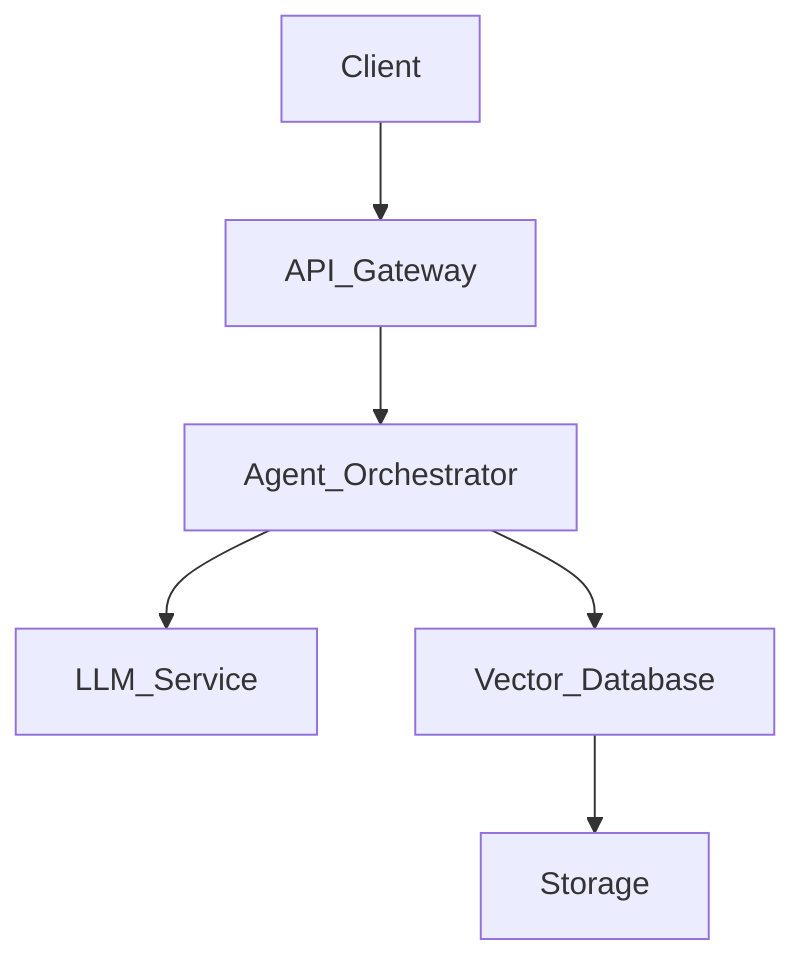

<!-- Replace [PROJECT_NAME], [DESCRIPTION], [URL], etc. with actual project details -->
<div align="center">

  <!-- 1. Hero Banner / Icon -->
  <a href="[LIVE_DEMO_URL]">
    
  </a>

  <h1>[PROJECT_NAME]</h1>

  <!-- 3. Description -->
  <p>
    <b>[A punchy, one-sentence description explaining what the project does, the architecture, and who it's for]</b>
  </p>

  <!-- 2. Badges -->
  <p>
    <a href="[URL]"></a>
    <a href="[URL]"></a>
    <a href="[URL]"></a>
    <a href="[URL]"></a>
  </p>

  <!-- 4. Live Demo -->
  <h4>
    <a href="[LIVE_DEMO_URL]">View Live Demo</a>
    <span> · </span>
    <a href="[DOCUMENTATION_URL]">Read Documentation</a>
    <span> · </span>
    <a href="https://github.com/[USERNAME]/[REPO]/issues">Report Bug</a>
  </h4>
</div>

---

## 📸 5. Screenshots & 6. Demo

<div align="center">
  <!-- Replace with high-quality WebP or PNG images -->
  
  
  <br><br>
  <!-- Replace with highly compressed GIF or MP4 to GIF -->
  
</div>

---

## ✨ 7. Core Features

- **[Feature 1 Name]**: [Detailed description of the feature and the underlying engineering value].
- **[Feature 2 Name]**: [Detailed description of the feature and how it solves a complex problem].
- **[Feature 3 Name]**: [Detailed description of the feature and its performance capability].
- **[Feature 4 Name]**: [Detailed description of the feature].

---

## 🧠 8. Architecture

> [!NOTE]  
> Provide a brief explanation of how the system is designed. Explain the flow of data, the microservice architecture, or the interaction between the multi-agent nodes.



---

## 🛠 9. Tech Stack

| Category | Tools & Technologies |
| :--- | :--- |
| **Frontend** | `React`, `Tailwind CSS`, `Vite` |
| **Backend** | `FastAPI`, `Python`, `Node.js` |
| **AI / ML** | `LangGraph`, `RAG`, `ChromaDB` |
| **Infrastructure**| `Docker`, `GitHub Actions`, `AWS` |

---

## 📂 10. Folder Structure

```text
[PROJECT_NAME]/
 ├── .github/               # GitHub Actions CI/CD workflows
 ├── src/                   # Source code
 │   ├── api/               # API routes and controllers
 │   ├── components/        # Reusable UI components
 │   ├── core/              # Core business logic and agents
 │   ├── models/            # Database and Pydantic schemas
 │   └── utils/             # Helper functions and utilities
 ├── tests/                 # Unit and integration tests
 ├── .env.example           # Example environment variables
 ├── docker-compose.yml     # Docker compose configuration
 └── README.md              # Project documentation
```

---

## 🚀 11. Installation

### Prerequisites
- [Dependency 1] (e.g., Python >= 3.10)
- [Dependency 2] (e.g., Docker & Docker Compose)
- [Dependency 3] (e.g., Node.js >= 18.0)

### Steps
1. **Clone the repository**
   ```bash
   git clone https://github.com/[USERNAME]/[PROJECT_NAME].git
   cd [PROJECT_NAME]
   ```

2. **Install dependencies**
   ```bash
   # Using Python/pip
   pip install -r requirements.txt
   
   # Or using npm/yarn
   npm install
   ```

---

## 🔐 12. Environment Variables

To run this project, you will need to add the following environment variables to your `.env` file.

| Variable Name | Description | Default Value |
| :--- | :--- | :--- |
| `DATABASE_URL` | Connection string for the primary database | `mongodb://localhost:27017` |
| `OPENAI_API_KEY` | Authentication key for external LLM API integration | `None` |
| `ENVIRONMENT` | Execution environment (`dev`, `staging`, `prod`) | `dev` |

---

## 💻 13. Usage

> [!TIP]  
> Include code snippets, CLI commands, or screenshots demonstrating how to use the core functionality of the project, especially the API inputs/outputs.

```bash
# Start the backend server
uvicorn main:app --reload

# Start the frontend client
npm run dev
```

---

## 📚 14. API Documentation

| Endpoint | Method | Description | Authentication |
| :--- | :--- | :--- | :--- |
| `/api/v1/health` | `GET` | Returns system health and readiness status | `None` |
| `/api/v1/agent/run` | `POST` | Initiates the multi-agent workflow | `Bearer Token` |
| `/api/v1/data/query` | `GET` | Retrieves processed semantic RAG data | `API Key` |

---

## ⚡ 15. Performance Metrics

> [!IMPORTANT]  
> Highlight the scalability and efficiency of your engineering work. Numbers prove impact.

- **Response Time:** < 50ms average (P99 at 120ms)
- **Throughput:** Capable of handling 5,000+ concurrent connections via asynchronous processing.
- **Model Inference:** Optimized LLM calls utilizing caching, reducing latency by 40%.

---

## 🚧 16. Challenges Faced

- **[Challenge 1]**: [Describe a significant technical hurdle you encountered (e.g., managing state across distributed autonomous agents)].
- *Solution*: [Explain how you engineered a solution (e.g., implemented a Redis-based locking mechanism and state-graph updates)].
- **[Challenge 2]**: [Describe another architectural challenge].
- *Solution*: [Explain the solution implemented].

---

## 🗺 17. Future Improvements

- [ ] Implement robust rate-limiting and DDoS protection via API Gateway.
- [ ] Migrate long-running inference tasks to background Celery/Redis workers.
- [ ] Add comprehensive E2E testing using Playwright.
- [ ] Improve model response caching strategies for lower latency.

---

## 🤝 18. Contributing

Contributions are always welcome! Please adhere to standard software engineering best practices.

1. Fork the project
2. Create your feature branch (`git checkout -b feature/AmazingFeature`)
3. Commit your changes (`git commit -m 'Add some AmazingFeature'`)
4. Push to the branch (`git push origin feature/AmazingFeature`)
5. Open a Pull Request

---

## 📄 19. License

This project is licensed under the [MIT License](LICENSE) - see the LICENSE file for details.

---

## 📞 20. Contact

- **[Your Name]** - [AI Engineer / Backend Developer]
- **Email**: [YOUR_EMAIL@example.com]
- **LinkedIn**: [https://linkedin.com/in/[YOUR_USERNAME]](https://linkedin.com/in/[YOUR_USERNAME])
- **GitHub**: [https://github.com/[USERNAME]](https://github.com/[USERNAME])

---
<div align="center">
  <em>Engineered with passion by Akash Pal</em>
</div>
